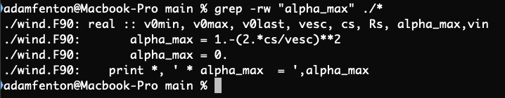

# BASH
## The best book about this stuff is The Linux Command Line by No Starch Press. Everything here is said better there...
---
### First - A note about the shebang
The default terminal shell on all the starlink machines in csh for some reason. You can
write bash scripts and run them using a csh shell by including the 'shebang' at the top of the
file. It tells the computer which program should be called to run this script. In this case we want bash but it could be python too for example.
```
#!/usr/bin/bash # This is the shebang

# This is a bash script
for i in $(seq -f '%03g' 1 10);
do
echo $i
done

# Will print 001, 002, 003 .. 010
```
This is good practice when you write bash scripts that are saved to a file. You generally do
this when you want to write a longer script.

**However, if you just want to write small one-liners then you can switch your terminal shell
from csh to bash by typing `bash` at the command line. This just gives you access to a bunch of tools that,
though they are present in csh, I find the syntax in bash easier to read and use. The normal commands
line `cd`, `ls` etc all stay the same**

### The find command
---
Say you have a big directory structure and, somewhere in all those subdirectories, you have a file that you know
is called **myfile.dat**.
You can use the `find` command to return the path to that file:

```
find . -name "myfile.dat"
find . -name "myfile.*" # If you don't know the extension...
```

Or you can use it to find all the directories in a directory tree
```
find . -type d # This will show ALL directories downwards from your cwd
find . -type d -name "directory_*" # shows all direcs with matching name
```

`find` is a really powerful command and has a **huge number** of options. If
you want to see how the command works with all its options you can see its manual
page with `man find`. This also works with any other linux command.

**The dot (.) in the find command means 'start looking from here i.e. the current working directory'.
 If you forget to put that dot then find will try to search the entire system which is something I would avoid...**

Find can also be really useful to pass files or directories to other commands.

### The grep command
---
The command I use the most is grep. By a long way. A long, long way...
Say you have downloaded a piece of open source software and, in one of the
option files you come across a parameter called `alpha_max`. You would like to
know how the code reads that value and what it does with it.
We can navigate to the code directory and look through each of the code files for where
that parameter is mentioned or, we can use grep:



The `-rw` flags say 'search all directories downwards of this one AND only produce exact matches of the pattern' Similar to `find`, you need to specify where to search but with `grep` it is done at the end of the command with `./*`. Again, `grep` is hugely useful and has endless applications. The best way to understand it is to read the manual page and just play with it.

### For loops
---
Bash for loops work much the same as they do in python but they do have different syntax. The script I wrote at the top of this chapter is an example of a for loop which prints the numbers 1 to 10 but pads (fills) them with zeros so that the final value is three digits long (001,002..010).
<br>
You don't have to write a full shell script for a simple for loop though, it can be done on the command line on one line as long as you seperate the conditions with semi-colons (`;`).
```
for name in */; do echo $name;done

```
is a very simple look which just loops through all directories in a folder with the `*/;` part of the command and echos their name.
You can make them as complicated as you like, I used them a lot to submit multiple jobs on a cluster at once without having to change directory and submit each job manually:
```
for run in run_*; do sbatch -A dp231 $run/run.job;done
```

### The AWK command
---
The `awk` command is hugely useful and has a massive number of applications so you can read the manual and The Linux Command Line for more info but essentially it is a simple command line program that interacts with files containing
text or numbers etc. The syntax is not immediatly obvious and you kind of learn by example. So say we have a simulation running that appends a line to a file called data.dat at each timestep. The first column of that line is the time (in code units or whatever) and we want to be able to quickly see how far through the simulation is. We can use `awk` to find the first line and the last entry on that line with
```
awk END'{print $1}' data.dat
```
Here, the `print $1` part tells the progam to focus on the first column (index starts at 1 not 0 as it does in python). It assumes that the program is whitespace seperated, I think it is just a single space and not a tab etc. But we can define our own seperator with the `-F` flag, see below.
If `my_file.txt` contains a single line "This:is:a:new:text:file"
```
awk -F ':' '{print $4}' my_file.txt
```
would print "new".

### Piping from one command to another
---
A pipe (|) in linux passes the results of one command to the next. A simple example is :
```
history | grep -w "find"
```
This would show you all the commands in the last session that you used that contained the word `find`.

### The sed Command
---
Sed in linux stands for stream editor. It is essentially a find and replace tool and works quite well with
piping results from grep or awk etc to build more powerful programs. The syntax is a little hard to explain but
read the manual and find some examples on stack overflow. Below is an example I have written.
```
sed -i '' "s/old_value/new_value/g" run_dir/disc.in
```
The `-i` flag basically means you edit the file permenantly, if you don't include it, the changes wont be saved. The s and g characters define the boundaries of the replace command and the `/` seperates the find from the replace. This command finds all instances of "old_value" in disc.in and replaces is with "new_value". The way I used this was a bit more complicated and I have included the full example in the /examples directory. In there, I actually assign variables to old_value and new_value (as indicated by the $ character infront of them.) Essentially, if I type `my_var='my new string'` and then call the variable with `$my_var`, I will get 'my new string'.
